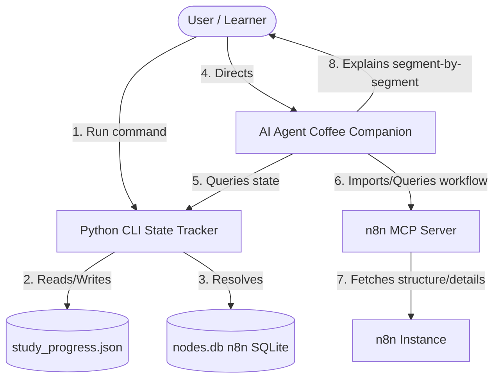

# Agentic n8n Study Companion ☕🚀

A robust, interactive system designed to help developers master **n8n workflows and nodes** at an architectural level. This repository implements a **Human-in-the-loop Agentic Learning System** by bridging a local Python CLI state tracker, a specialized AI Agent, and n8n via the Model Context Protocol (MCP).

---

## 🏗️ System Architecture

Instead of traditional passive learning, this project sets up an active, structured learning loop:



1. **State Manager (Python CLI):** Tracks study progress, caches the active template ID, resolves the location of n8n templates database (`nodes.db`), and supports bilingual commands.
2. **AI Agent Prompt (The Coffee Companion):** A highly customized instruction set that governs the AI's explanation flow, ensuring it explains things node-by-node, waits for explicit user permission, searches the web for verification, and avoids hallucinations.
3. **MCP Integration (`n8n-mcp`):** Allows the AI Agent to query the actual local/remote n8n instance to fetch structural topologies or specific node details dynamically.

---

## 🛠️ Features of the Python CLI (`study.py`)

The CLI script is built with professional coding standards in mind:
* **Atomic JSON Writes:** Uses `tempfile` to write state safely, preventing data corruption.
* **Dynamic DB Resolution:** Searches local directories (like AppData `npm-cache/_npx`) and fallback paths to locate the n8n-mcp SQLite database (`nodes.db`).
* **Bilingual CLI Aliases:** Full native support for both Arabic and English commands (`خلصت` / `done`, `تراجع` / `undo`, `الحالة` / `status`).
* **Robust Error Boundaries:** Automatic backup and reset of corrupted JSON files.
* **Zero Dependencies:** Uses Python's standard library only (`sqlite3`, `json`, `argparse`, `pathlib`).

---

## 📂 File Structure

* **[study.py](file:///D:/الكود/برمجة/قوالب%20n8n/study.py)**: The Python CLI utility script.
* **[agent_instructions_ar.md](file:///D:/الكود/برمجة/قوالب%20n8n/agent_instructions_ar.md)**: The original Arabic instructions prompt for the AI Agent.
* **[agent_instructions_en.md](file:///D:/الكود/برمجة/قوالب%20n8n/agent_instructions_en.md)**: The English translation of the AI Agent prompt.
* **[.gitignore](file:///D:/الكود/برمجة/قوالب%20n8n/.gitignore)**: Prevents local state and SQLite files from being committed.

---

## 🚀 Getting Started

### 1. Prerequisites
Ensure you have:
* Python 3.8+ installed.
* An active n8n instance.
* An AI coding assistant (like Gemini/Antigravity) equipped with the `n8n-mcp` server.

### 2. Setting Up the CLI
You can run the script directly:
```bash
python study.py
```

To make it easier, you can use the provided batch script (`study.bat`) or create a shell alias so you can simply type `study` from anywhere.

### 3. CLI Command Guide

| English Command | Arabic Alias | Action |
| :--- | :--- | :--- |
| `python study.py` | `python study.py` | Shows the active template or fetches the next template from the database |
| `python study.py done` | `python study.py خلصت` | Marks the current active template as completed and moves to the next |
| `python study.py undo` | `python study.py تراجع` | Rolls back the last completed template to active study state |
| `python study.py status`| `python study.py الحالة` | Shows a beautiful text-based progress bar and completion statistics |

---

## ☕ Agent Prompting Philosophy
The AI Agent is prompted to behave like a colleague sitting next to you at a coffee shop. It enforces:
* **Human-in-the-Loop Control:** The AI never proceeds to explain another node or sub-topic without the user typing an explicit command to proceed.
* **Strict Evidence-based Explanations:** The workflow nodes are treated as the sole source of truth to avoid hallucinations.
* **Architectural Depth:** Explanations focus not just on *how* to configure a node, but *why* it is used, its performance impacts, best practices, and error handling.
