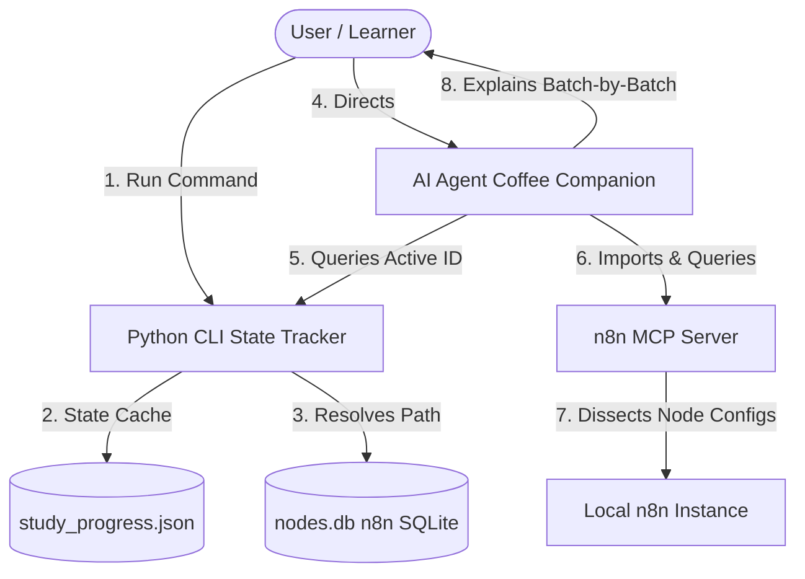

# n8n Study Companion: An Agentic Learning System ☕🚀

> **Ditch passive reading. Master n8n workflow architecture through an automated CLI curriculum and a tool-enabled AI mentor.**

---

## 🎯 The Dilemma: Moving from "Docs" to "Architect"

Reading the official n8n documentation is easy, but transitioning to production-grade freelance or enterprise development is where most developers stall. You face three critical bottlenecks:

*   **Template Chaos & Redundancy:** The web is flooded with low-quality, duplicate, or outdated workflows. Finding high-value templates that follow modern best practices is a constant struggle.
*   **Cognitive Progression Loss:** Without a structured state machine, it is nearly impossible to track which node patterns you have mastered and which ones you haven't. You end up in "tutorial hell," repeating the same concepts.
*   **Decision Fatigue:** Spending 30 minutes deciding *what* to study next instead of actually *learning* drains the mental energy required for deep, focused analysis.

---

## 💡 The Breakthrough: Tool-Enabled Learning

This repository implements a **Human-in-the-loop Agentic Learning System** that completely automates your educational trajectory. 

I built this system to solve my own learning bottlenecks, and the results were immediate and game-changing. By hooking a local Python CLI state tracker to an AI agent equipped with Model Context Protocol (MCP), I established a highly disciplined, interactive feedback loop:

*   **Dynamic Local Sourcing:** The system feeds directly from your active local n8n SQLite templates database (`nodes.db`), ensuring you are always learning from real, up-to-date node structures.
*   **Zero Planning Overhead:** The CLI manages the curriculum state. You never have to ask "what next?"—the system routes you and the AI mentor automatically.
*   **Live Node Dissection (The MCP Advantage):** The AI companion doesn't just read code or talk theory. Via the MCP bridge, it interacts directly with your local n8n server—importing draft workflows, querying topologies, and guiding you through actual configurations node-by-node.
*   **Atomic Progress Guard:** Progress is persisted safely in `study_progress.json` with write-safety guarantees, keeping your study logs intact.

---

## 🏗️ System Architecture

The learning loop is designed around strict human authorization and structured data flow:



1.  **State Manager (Python CLI):** Resolves the n8n template cache path, handles progress transitions, and provides a lightweight CLI.
2.  **AI Agent Prompt (The Coffee Companion):** A rigorous instruction set that forces the AI to explain workflows incrementally, batch nodes to protect context limits, detect anti-patterns, and wait for human confirmation before proceeding.
3.  **n8n MCP Server:** The protocol bridge allowing the AI to query, control, and inspect n8n resources directly.

---

## 🛠️ Prerequisites & Community Stack

To run the interactive loop, you need:
1.  **Python 3.8+** (standard library only).
2.  **Active n8n Instance** (running locally or accessible).
3.  **The n8n MCP Server by czlonkowski (Required):** This project relies heavily on the excellent Model Context Protocol server developed by **czlonkowski**:
    *   **Repository:** [czlonkowski/n8n-mcp](https://github.com/czlonkowski/n8n-mcp)
    *   This server gives the AI Agent the "hands" to query node configurations, verify JSON properties, and fetch workflow topologies directly from your environment.
4.  **An MCP-Compatible AI Assistant:** An AI coding assistant or client that supports the Model Context Protocol (MCP) to load the server and execute commands. Supported options include:
    *   **Antigravity:** Google DeepMind's agentic workspace environment.
    *   **Codex:** An autonomous AI software engineering agent (available as a CLI, IDE extension, and desktop app).
    *   **Claude Code:** Anthropic's official CLI-based terminal agent.
    *   **Cursor:** AI-native code editor/IDE.
    *   **Open Code:** An open-source terminal-based AI coding agent with configurable tool integrations.

---

## 📂 File Structure

*   **`study.py`**: The CLI state tracking script.
*   **`study.bat`**: Windows shortcut to run the CLI globally.
*   **`agent_instructions_ar.md`**: The Arabic system prompt for the AI Agent (The Coffee Companion).
*   **`agent_instructions_en.md`**: The English system prompt for the AI Agent.
*   **`.gitignore`**: Excludes local database files and study states from version control.

---

## 🚀 Usage Guide

### 1. Initialize the CLI Tracker
Start the tracker to verify your database connection and output your current active template:
```bash
python study.py
```
*Tip: Set up a shell alias `study` pointing to `study.bat` so you can call it from any folder.*

### 2. Bilingual CLI Command Cheat-Sheet
The CLI supports bilingual command aliases for quick navigation:

| Command | Arabic Alias | Action |
| :--- | :--- | :--- |
| `python study.py` | `python study.py` | Prints the active template under study |
| `python study.py done` | `python study.py خلصت` | Marks the active template completed and loads the next |
| `python study.py undo` | `python study.py تراجع` | Reverts the last completed template to active study |
| `python study.py status`| `python study.py الحالة` | Displays a visual progress bar and completion statistics |

---

## ☕ The Prompts Philosophy
The AI Agent is configured to act as an expert peer sitting next to you at a coffee shop:
*   **Strict Human-in-the-Loop:** The AI is blocked from auto-advancing or dumping massive amounts of information. It explains one point at a time and waits for your confirmation.
*   **Zero Guesswork:** It treats node configurations as the sole source of truth. If a property is unclear, it searches the web instead of guessing.
*   **Architecture Over Syntax:** It evaluates *why* design decisions were made, critiques inefficiencies (detecting anti-patterns), and reviews performance footprint.
